# git-R-done: Effective project management in RStudio

[RStudio](https://www.rstudio.com/) makes it easy to write and execute R code in all kinds of ways: we can run commands on the console, we can run lines from our `.R` files, we can "source" (or run the entirety of) our `.R` files, we can import packages, create packages, analyze data, create data, and I'm sure I've only scratched the surface. We usually write our R scripts for the present...to produce the chart or map or table we need for our thesis or paper or boss. There's plenty of theories and even some scholarly articles regarding [best practices for scientific computing](http://journals.plos.org/plosbiology/article?id=10.1371/journal.pbio.1001745). You probably don't have time to read all of them (I certainly didn't), but it's fairly intuitive that **writing code that's easy to understand and re-use in the future is a good idea**. There's more than a few ways to go about doing this, but for the purposes of this tutorial we're going to say the three things you should do to make things easy on yourself later are **avoid copy and paste**, **structure your files**, and **use git to backup and share your code**.

## Avoid copy & paste (or *modularizing* your code)
I understand better than anybody that when you sit down to write code the first thing you have to do is *just make it work*. While you're doing that, copy and paste all you want! Until you have something that works, there's nothing worth using in the future anyway. As an example we'll take some secchi depth data from a two lakes near Halifax, Nova Scotia and plot it.

```R
sddata <- read.delim("secchi_depth_data.txt")

# get first lake data
firstlakedata <- sddata[sddata$lake=="First Lake",]

# get second lake data
secondlakedata <- sddata[sddata$lake=="Second Lake",]

# plot first lake data
plot(firstlakedata$date, firstlakedata$sd, pch=18, xlab="Date", 
     ylab="Secchi Depth")
title("First Lake Secchi Depth")

# plot second lake data
plot(secondlakedata$date, secondlakedata$sd, pch=18, xlab="Date", 
     ylab="Secchi Depth")
title("Second Lake Secchi Depth")
```

You'll notice that in plotting the data for both lakes, **the code to plot the first lake is the same as the code to plot the second** (only the name of the lake is different). This bad for a few reasons: every time I change the code to plot the data for one lake I have to make a nearly identical change in some other line of code. Not only is this time consuming (imagine if you had 30 lakes), it's a great way to introduce errors into your project. The reason you can tell immediately that this was a bad move: **I had to copy and paste my code, then change it slightly**. Any time you run into this problem, make a function.

```R
sddata <- read.delim("secchi_depth_data.txt")

# define function to plot data
plot_secchi_depths <- function(lakename) {
  lakedata <- sddata[sddata$lake==lakename,]
  plot(lakedata$date, lakedata$sd, pch=18, xlab="Date", 
       ylab="Secchi Depth")
  title(paste(lakename, "Secchi Depth"))
}

# call function with both lake names
plot_secchi_depths("First Lake")
plot_secchi_depths("Second Lake")
```

With two lakes it doesn't make much of a difference, but it saves a whole lot of work the more times you have to copy and paste something. What if you wanted to change the title of each plot? It's a simple example, but you can see how we're working towards code that can easily be reused as opposed to code specific to your project.

Taking it a step further, we can *parameterize* the function, so we can customize each call we make to the function.

```R
sddata <- read.delim("secchi_depth_data.txt")

# define function to plot data
plot_secchi_depths <- function(lakename, pch=18, col="black") {
  lakedata <- sddata[sddata$lake==lakename,]
  plot(lakedata$date, lakedata$sd, pch=pch, col=col, xlab="Date", 
       ylab="Secchi Depth")
  title(paste(lakename, "Secchi Depth"))
}

# call function with both lake names
plot_secchi_depths("First Lake", col="green")
plot_secchi_depths("Second Lake", col="red")
```

If we wanted to make the function completely self-contained, we could also pass our original `data.frame` as an argument, so that not only could we use the function in this script, but we could use the function in *any* script that had a `sd` column and a `date` column.

```R
sddata <- read.delim("secchi_depth_data.txt")

# define function to plot data
plot_secchi_depths <- function(alldata, lakename, pch=18, col="black") {
  lakedata <- alldata[alldata$lake==lakename,]
  plot(lakedata$date, lakedata$sd, pch=pch, col=col, xlab="Date", 
       ylab="Secchi Depth")
  title(paste(lakename, "Secchi Depth"))
}

# call function with both lake names
plot_secchi_depths("First Lake", col="green")
plot_secchi_depths("Second Lake", col="red")
```

You can see now that **we've created code that we could literally drop straight into another project without changing a single line of code** (provided we've formatted the data in the same way). This is a very simple example, but I have many plotting functions that I use over and over again when working on similar projects. I almost never get away with leaving a function completely untouched (there's always *something* I didn't think of when I wrote the function the first time), but **because I took the time to split my code into re-usable parts, I saved tons of time**. You'll hear this also called *modularizing* your code (as in, splitting your code into *modules*).

## Structure your files

Right now we have two files: a file for our data (secchi_depth_data.txt) and a file that contains code to plot our data. These files would probably do just fine sitting anywhere on our computer, but each time we run the code we have to make sure that our *working directory* is in the right place so when we call `read.delim("secchi_depth_data.txt")`, R knows where to find `"secchi_depth_data.txt"`. If you downloaded the tutorial notes, you already know they're within an **RStudio Project**, which is the easiest way to never have to think about a working directory ever again.

I am the first to admit that I am extremely picky about the way I structure my files. That said, I'll show how I structure my projects and why, just as an example. The real key in structuring your RStudio projects is that you **understand what your code is doing**, you can **find your data/code/output quickly**, and that you make it **easy to share your code**. Here's what our small example project might look like:


I have a **data-raw** folder that contains the original data (in this case from two separate honours theses from several years ago). If you used any R code to clean the data, this is also a good place to put it. The **data** folder in our project contains any data that will be loaded by an R script, the **scripts** folder contains R code, and the **figures** folder contains the figures that were generated from **scripts**. Sometimes I have a **tables** folder if I use R to generate a table of values that I'll later use in a document, and sometimes I have a **functions** folder if I have a lot of functions. 

You'll notice there's a new file named `plot_secchi_depths.R`, where I've moved the `plot_secchi_depths()` function we defined earlier. For such a small function, it's probably overkill to do this, but the idea is to **split the project up into independently functioning parts**. `plot_secchi_depths.R` now looks like this:

```R
# define function to plot data
plot_secchi_depths <- function(alldata, lakename, pch=18, col="black") {
  lakedata <- alldata[alldata$lake==lakename,]
  plot(lakedata$date, lakedata$sd, pch=pch, col=col, xlab="Date", 
       ylab="Secchi Depth")
  title(paste(lakename, "Secchi Depth"))
}
```

And `flsl_secchi_plots.R` now looks like this:

```R
#load data
sddata <- read.delim("data/secchi_depth_data.txt")

#load plot_secchi_depths() from plot_secchi_depths.R
source("scripts/plot_secchi_depths.R")

# call function to make both plots, save to figures/
png("figures/first_lake_sd.png")
plot_secchi_depths(sddata, "First Lake")
dev.off()

png("figures/second_lake_sd.png")
plot_secchi_depths(sddata, "Second Lake")
dev.off()
```

You'll notice a few changes to the script. First, `secchi_depth_data.txt` is now `data/secchi_depth_data.txt`, because it's now in the `data/` directory in our project. Instead of defining `plot_secchi_depths()` in the file, we now `source("scripts/plot_secchi_depths.R")`. In the plotting section, we save our plots to files instead of just looking at them (sometimes I build this into my plotting functions so that if I pass a `filename=` argument it will save, and if I don't it will plot in RStudio). The script is slightly more readable, and it does one thing (produce two plots).

This is an obviously over-the-top example, but the idea is that I'm **separating raw data**, **input**, **re-usable functions**, **project-specific code**, and **output**. Choose whichever structure makes the most sense to you, but when it comes time to **share your code using git** it will make life a little bit easier.


## Use git to backup and share

The whole point of this tutorial is to write code that you can **share** and **use easily in the future**. Now that we have nice, clean *modularized* code, we can use **git** to *create a history of the changes* we make in our project, and **GitHub** to *backup these changes* and make it easy for others (and ourselves) to use the code we've spent hours and hours writing.

### Why use Git?

Have you ever saved versions of an R script like "myscript_version1.R", "myscript_version2.R", myscript_final.R" (and inevitably) "myscript_final_real_actually.R"? Before I discovered git I certainly did, because that history is an important history to keep...what worked in the past (in case something you try in the future doesn't). You can save as many times as you want using git without ever having confusing copies of your file. Some projects can have hundreds or thousands of files, making it unweildy to do anything else. The average R script writer isn't in this category, but it's still useful to have that history kept intact. Here's an example (not from R) of a file I worked on extensively for an Android app I wrote...you can see each line of code and why I changed them.


### Why use GitHub?

[GitHub](http://github.com/) is a place where git repositories live on the internet. The advantage of having them there is that anybody can access your source code by just sharing a link (instead of emailing a file), making code beyond easy to share and ensuring that if anything happens to your computer, your precious deveopment history is saved. Having lost hours and hours of code to computer malfunctions before, I can assure you that it's incredibly nice to have that history somewhere safe. GitHub also has tons of features for making website and forking projects, but for now all you really have to know is that GitHub backs up your code and all the changes you've ever saved (using git).

### Ok, I'll do it!

Great! Glad to hear it. The first thing you'll need is a [GitHub Account](https://github.com/join), if you don't already have one. The second is the [GitHub Desktop App](https://desktop.github.com/). If you can open up the GitHub Desktop app and get a window something like this, you're good to go (except you won't have any repositories).

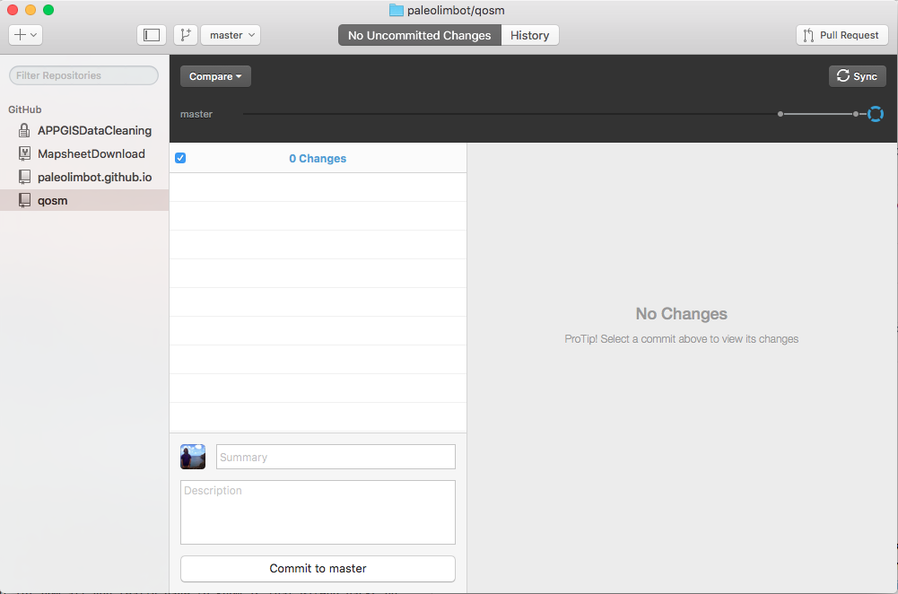

### Using Git

The basic idea behind git is that you **commit** your changes, then **push** or **sync** them with GitHub. This sounds confusing but you will get the hang of it...just keep saying to yourself: **work** on my project, **commit** my changes, **sync** them with GitHub...**work** on my project, **commit** my changes, **sync** them with GitHub. Each **commit** is a moment in time that is saved in your git history (called a **repository**), so whenever you make a change that's important you should **commit** that change (and then **sync** it with GitHub so that your changes are backed up online).

Next we have to create a git **respository** in our RStudio project directory. In case you're wondering, the repository actually lives inside a special `.git` folder inside your project directory, but you don't have to know that. To start using git with a project you've already created in RStudio, click the "+" on the top left of the GitHub Desktop App screen.

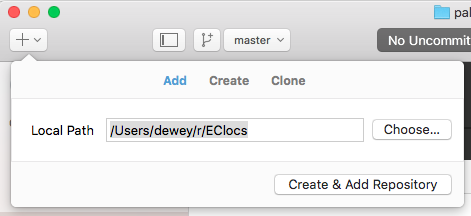

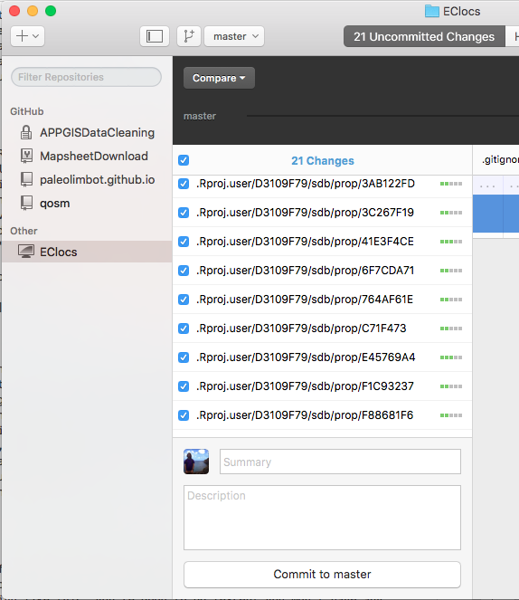

You will now have a very confusing looking screen telling you that you have "Uncommited Changes" in your `.Rproj.user` folder. The `.Rproj.user` folder is a folder that RStudio generates automatically that we need to tell git to ignore. To do this, choose "Repository Settings..." under the "Repository" menu.

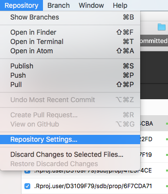

Then we have to add a few lines under "Ignored Files" so that Git knows that we don't want to track changes to files that RStudio generates automatically. The three lines that you'll need in RStudio projects are `.Rproj.user`, `.Rdata`, and `.Rhistory` (note the leading `.` in each).

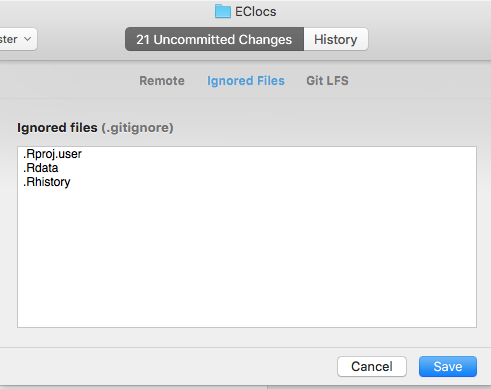

Once you hit "Save", you should get a much more manageable looking window showing all the files you have in the repository. If there's any more you'd like to ignore (such as files that are generated by a script or large input files) you can right click the file and choose "Ignore" (the app will automatically add a line to your `.gitignore` file). In a few steps we'll be uploading this data to GitHub, so if there's any data that shouldn't be available to the world, you'll also want to "Ignore" those files as well. If you want to "Ignore" an entire foler, you'll have to do that in the "Repository Settings" dialog that we just used. Your screen should now look like this:

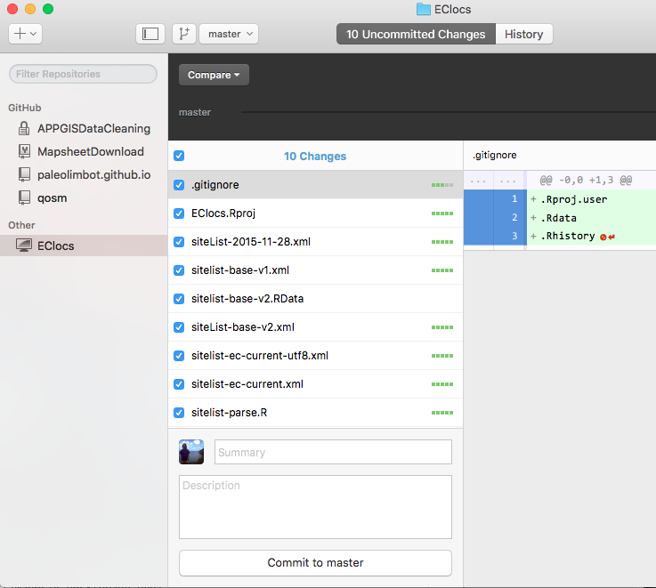

Now you're ready to make your first **commit**! You'll notice the check mark on the left next to all your files. For your first commit, you'll want to leave all of these checked (any file that isn't checked will not be included in your **commit**). Type a short message like "first commit", in the "Summary" box, and click "Commit to master".

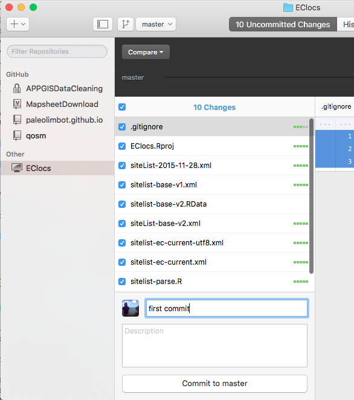

Your screen should now look like this. Now that we've made our first **commit**, we will **push**/**sync** our data to GitHub. Since we haven't created a place for our **repository** on GitHub yet, we need to click on **Publish**, at the top right of the screen.

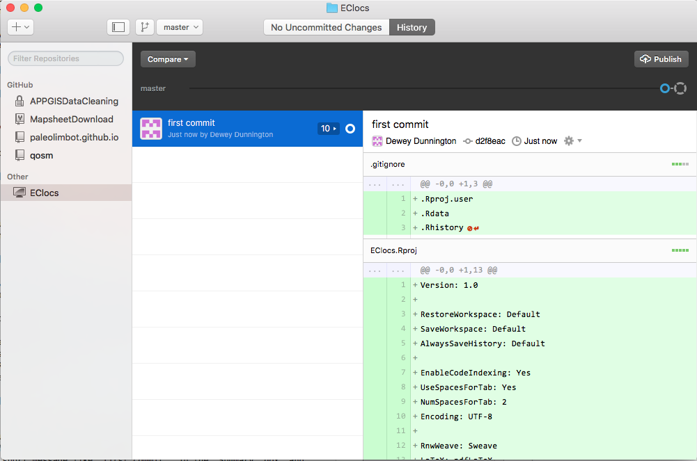

Type in a name and click "Publish". **Note that once you do this anybody will be able to see the files in your project**. It's unlikely anybody will care, but if you have code or data you'd like to keep private, you'll have to upgrade your GitHub account or "Ignore" the file in the GitHub Desktop app. This is mostly not a problem, generally having your development history is more valuable than anybody wanting to steal your data/code.

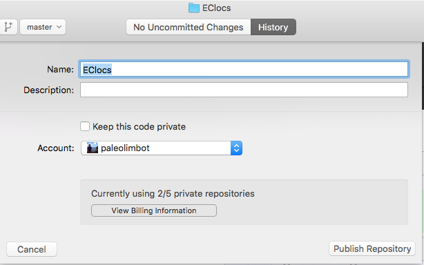

Now that you've created a place for your **repository** on GitHub, your screen should look like this. Note that "Publish" has now become **Sync**.


It's worth checking out how your repository looks on the web now, since you can now access it through the GitHub website. Go to github.com or Right click your repository and choose "View On GitHub", and you should end up with something like this:

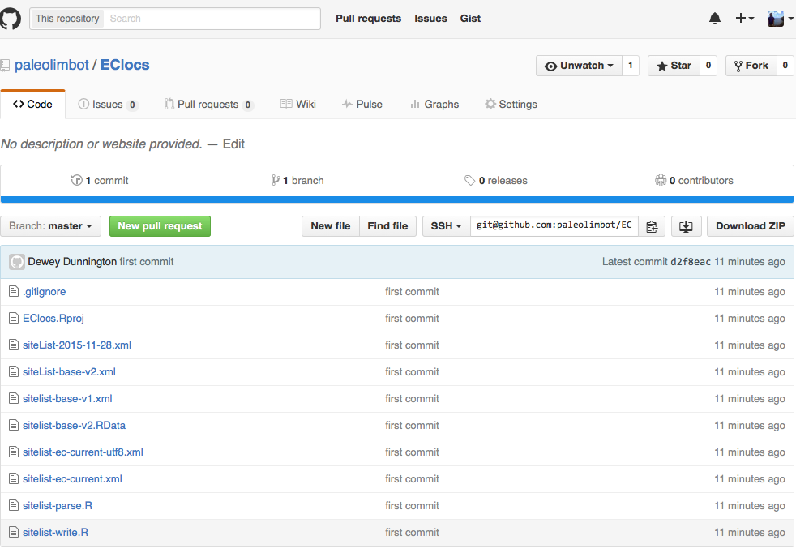

If all your files are there you've done it right! Your precious code is now backed up for all eternity (well, as long as GitHub is a business, which will probably be a long time). Now that everything is setup, let's go through another round of **work** on your project, **commit** your changes, and **sync** to GitHub. Open up your project in RStudio and edit one of your files, then hop back to the GitHub Desktop App and go to the "Uncommitted Changes" tab. I added a comment in one of my files, and when I opened up the GitHub Desktop app it looked like this.

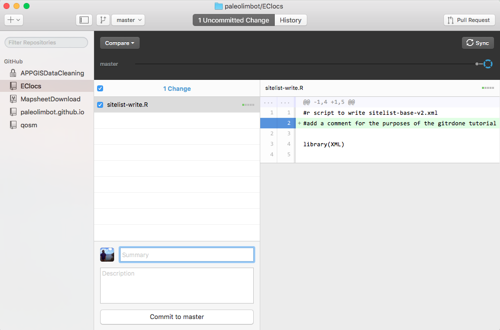

Now we have to **commit** the changes we made. Type a message describing the changes you made (and do try to be descriptive, things like "update project" are not helpful when you're looking back through your history). Click "Commit to master" to commit your changes!

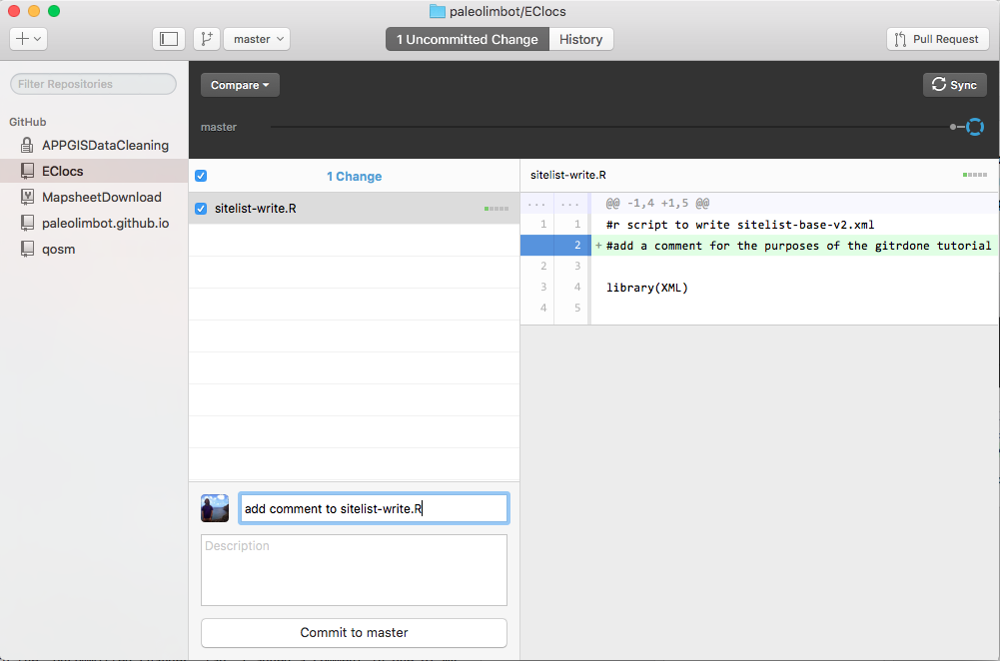

Then click **Sync** to upload your changes to GitHub. Now your changes are backed up! I always do this when I do something coding that I really don't want to do again (I think I already mentioned the time I lost a whole day of coding and almost cried). Try the **work** on your project, **commit** your changes, and **sync** to GitHub cycle a few more times just to get the hang of it, once things are setup it's pretty easy.

We're almost done, but the one more thing I'd like to mention is that support for Git is built in to RStudio itself! This tutorial uses the GitHub app because it's very user friendly, but for projects that I work on primarily in RStudio it's very convenient to do my committing and pushing from within RStudio itself without having to bother with the GitHub Desktop app. For this, I'll refer you to [Hadley Wickam's tutorial](http://r-pkgs.had.co.nz/git.html) on the subject.

We've only scratched the surface with regard to what Git can do, but probably 95% of the time all I do with Git is **work**, **commmit**, and **sync** just to keep my code and data backed up somewhere that won't disappear if my computer dies. For all sorts of tutorials on how to use the app for collaboration with others and contributing to open source projects, check out the [GitHub help page](https://help.github.com/).