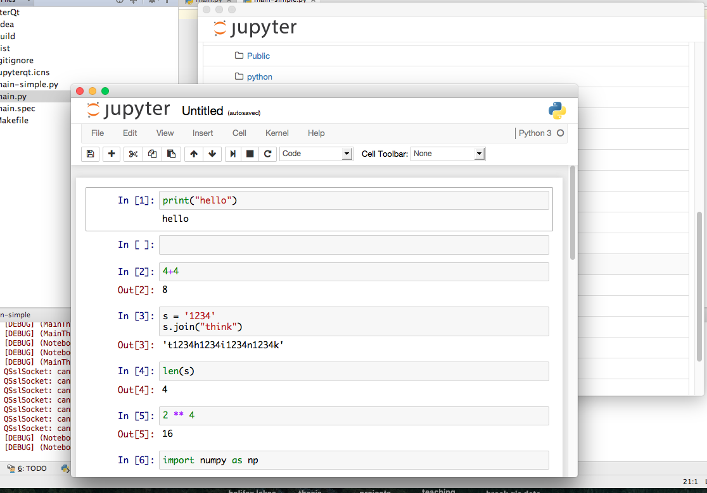

One thing that has always bothered me about Python is that there is no [RStudio](http://www.rstudio.com/) that exists as an IDE for scientific analysis in Python. There are attempts, such as [Spyder](https://pythonhosted.org/spyder/) and [Canopy](https://www.enthought.com/products/canopy/) (among others), but the closest you can get is [Jupyter](http://jupyter.org/), the latest iteration of IPython Notebook. I quite like Jupyter as a venue for analysis using Python, but I don't like that it's in a web browser. This is picky, I know, but my internet is my internet and my work is not, and I don't like them in the same place.

All this leads to my programming addiction, which I employed to write a simple wrapper around the `jupyter-notebook` console command using a `QWebView` from the [PyQt](https://riverbankcomputing.com/software/pyqt/intro) bindings for the [Qt framework](http://www.qt.io/qt-framework/). Its usefulness is suspect, but it was a good excuse to tackle a problem in Python that used `threading`, the `subprocess` module, and a couple of PyQt tricks of the trade. Follow step by step or check out the [raw Python file](jupyterqt_simple.py).

First off, the `import` statements. I chose to import everything individually, but the standard `from PyQt5.QtCore import *` works just as well. Also note I happen to be using PyQt5 here, but I doubt anything except the import statements are different if you happen to be using PyQt4. Also worth noting here that I'm using Python 3, although off the top of my head I don't see anything that would trip up in Python 2.

```Python
from PyQt5.QtCore import pyqtSlot, QSettings, QTimer, QUrl, QDir
from PyQt5.QtWidgets import QMainWindow, QFileDialog, QMessageBox, QApplication
from PyQt5.QtWebKitWidgets import QWebView, QWebPage

import sys
import subprocess
import signal
import logging
import threading
```

The we setup the logging. I usually create a `log()` shorthand function out of convenience. We'll be using multiple threads here, so it's handy to have the `threadName` be logged as well.

```Python
logfileformat = '[%(levelname)s] (%(threadName)-10s) %(message)s'
logging.basicConfig(level=logging.DEBUG, format=logfileformat)

def log(message):
    logging.debug(message)
```

Next we'll start the server. Basically, we want to call the `jupyter-notebook` command and hold onto that process until the end of the program. We'll use `subprocess.Popen()` to do this, since this lets us hold onto the process (unlike `os.system()`). I condensed this into a function because you may want to change the values for some of these. The important parts here are the `bufsize=1`, which makes sure that the output is line-buffered (we'll want to read it and log it line-by-line and not all at once), and `stderr=subprocess.PIPE`, which gives us access to whatever the process writes to `stderr`. In this case, that all that the process writes to, but we could just as easily get access to `stdout`.

```Python
def startnotebook(notebook_executable="jupyter-notebook", port=8888, directory=QDir.homePath()):
    return subprocess.Popen([notebook_executable,
                            "--port=%s" % port, "--browser=n", "-y",
                            "--notebook-dir=%s" % directory], bufsize=1,
                            stderr=subprocess.PIPE)
```

Next we start the notebook process. We have to wait for the server to start before opening the webpage though, because we're not sure which address it will start on (even though you specify a port, if that port is taken already it will serve on another port). We'll loop, reading the output using `Popen.stderr.readline()` to read the output, looking for a web address on every line.

```Python
#start jupyter notebook and wait for line with the web address
log("Starting Jupyter notebook process")
notebookp = startnotebook()

log("Waiting for server to start...")
webaddr = None
while webaddr is None:
    line = str(notebookp.stderr.readline())
    log(line)
    if "http://" in line:
        start = line.find("http://")
        end = line.find("/", start+len("http://"))
        webaddr = line[start:end]
log("Server found at %s, migrating monitoring to listener thread" % webaddr)
```

Now we've gotten all we need out of the process from the main thread, but we'd like to continue logging the output in case something goes wrong. We'll do this using the `threading` module, defining a function and using it as the `target` for the `Thread` object. Note that it's also possible to subclass `QThread` for multithreading in Qt, but unless you have to communicate with your thread it's usually not worth it.

```Python
#pass monitoring over to child thread
def process_thread_pipe(process):
    while process.poll() is None: #while process is still alive
        log(str(process.stderr.readline()))

notebookmonitor = threading.Thread(name="Notebook Monitor", target=process_thread_pipe,
                                   args = (notebookp,))
notebookmonitor.start()
```

This thread will run until the process is no longer running (i.e. `process.poll()` stops returning `None`, dutifully logging the output using the `log()` function we defined earlier. Now we're ready to setup the application.

```Python
#setup application
log("Setting up GUI")
app = QApplication(sys.argv)
app.setApplicationName("JupyterQt")
app.setOrganizationDomain("fishandwhistle.net")

#setup webview
view = MainWindow(None, homepage=webaddr)

log("Starting Qt Event Loop")
```

Now everything is setup, so we start the event loop.

```Python
result = app.exec_()
```

"But wait!" I can hear you say, "What the eff is 'MainWindow' and where did it come from?". Don't worry, we'll get there. First, let's pretend the user closes the application (thus ending the event loop), and so execution in our main file resumes. Now we have to make sure to properly destroy our `jupyter-notebook` process. In the termal we do this by pressing `Ctrl-C` but since we can't do that, we'll have to send an interrupt signal instead. We do this using the `Popen.send_signal()` method. Because we passed `-y` to `jupyter-notebook`, it should automatically close when we send it the interrupt signal. Still, if we don't kill the process here, it will linger on until the computer shuts down, so we want to make sure it's properly taken care of.

```Python
log("Sending interrupt signal to jupyter-notebook")
notebookp.send_signal(signal.SIGINT)
try:
    log("Waiting for jupyter to exit...")
    notebookp.wait(10)
except subprocess.TimeoutExpired:
    log("control c timed out, killing")
    notebookp.kill()

log("Exited.")
sys.exit(result)
```

Ok! Now we're ready to take a look at the PyQt angle to all this. Basically, we need two classes: one to be the main window, and one to be the custom `QWebView` that takes care of rendering the page. Qt's `QWebView` is a little finicky and doesn't let anything create a new window (or close one) without you're (the programmer) express written consent.

Let's start with the `MainWindow`. Theoretically it's possible to do all of this without a `QMainWindow` subclass, but if you'd like to add menus and a status bar, then this makes things a little easier. The basic idea is that it's created with a target `homepage`, restores its geometry from `QSettings()`, then starts a single-shot timer to start loading once the event loop starts. The advantage of doing this is that it lets the window open quickly before something time-consuming (like loading a webpage) has to happen. Overriding the `closeEvent()` method lets us close all the other windows before closing that one. You could theoretically ask the user using `QMessageBox.information()` if they would really like to exit, then call `event.ignore()` to stop the user from exiting.

```Python
class MainWindow(QMainWindow):

    def __init__(self, parent=None, homepage=None):
        super(MainWindow, self).__init__(parent)
        self.homepage = homepage
        self.windows = []

        settings = QSettings()
        val = settings.value("net.fishandwhistle/JupyterQt/geometry", None)
        if val is not None:
            self.restoreGeometry(val)

        self.basewebview = CustomWebView(self, main=True)
        self.setCentralWidget(self.basewebview)
        QTimer.singleShot(0, self.initialload)

    @pyqtSlot()
    def initialload(self):
        if self.homepage:
            self.basewebview.load(QUrl(self.homepage))
        self.show()

    def closeEvent(self, event):
        if self.windows:
            for i in reversed(range(len(self.windows))):
                w = self.windows.pop(i)
                w.close()
            event.accept()
        else:
            event.accept()

        #save geometry
        settings = QSettings()
        settings.setValue("net.fishandwhistle/JupyterQt/geometry", self.saveGeometry())
```

We also have to define the `CustomWebView` used above. Qt requires we do this because it won't open a new window unless we override the `createWindow()` method. Similarly, it won't close unless we connect the `windowCloseRequested` signal with the `self.close` slot. **It is incredibly important that you disconnect any signal you connect unless both objects remain valid for the entire duration of the application**. Seriously, you get really weird things happening that are nearly impossible to debug if you forget to do this.

```Python
class CustomWebView(QWebView):

    def __init__(self, mainwindow, main=False):
        super(CustomWebView, self).__init__(None)
        self.parent = mainwindow
        self.main = main
        self.loadedPage = None
    
    @pyqtSlot(bool)
    def onpagechange(self, ok):
        log("on page change: %s, %s" % (self.url(), ok))
        if self.loadedPage is not None:
            log("disconnecting on close signal")
            self.loadedPage.windowCloseRequested.disconnect(self.close)
        self.loadedPage = self.page()
        log("connecting on close signal")
        self.loadedPage.windowCloseRequested.connect(self.close)

    def createWindow(self, windowtype):
        v = CustomWebView(self.parent)
        windows = self.parent.windows
        windows.append(v)
        v.show()
        return v

    def closeEvent(self, event):
        if self.loadedPage is not None:
            log("disconnecting on close signal")
            self.loadedPage.windowCloseRequested.disconnect(self.close)
        
        if not self.main:
            if self in self.parent.windows:
                self.parent.windows.remove(self)
            log("Window count: %s" % (len(self.parent.windows)+1))
        event.accept()
```

There you have it! You obviously have to put the UI elements above the start of the application, but other than that you'll have a fully functioning Jupyter frontend in no time. For a version with more bells and whistles, check out the [JupyterQt repository](https://github.com/paleolimbot/JupyterQt).


